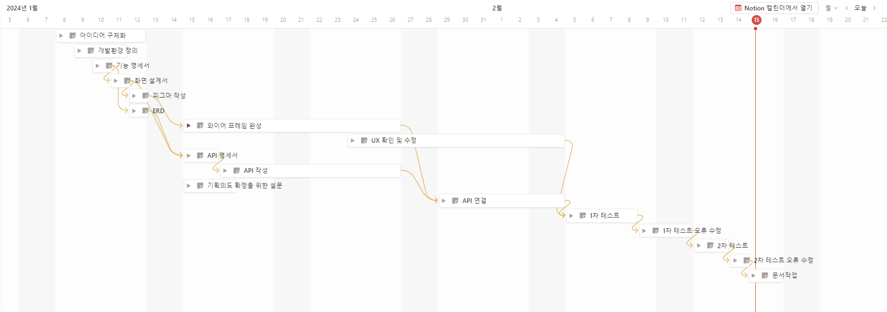
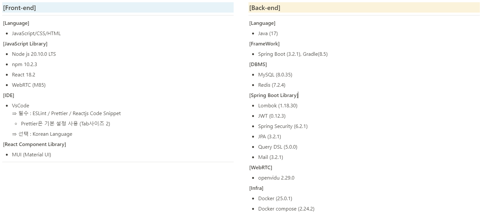
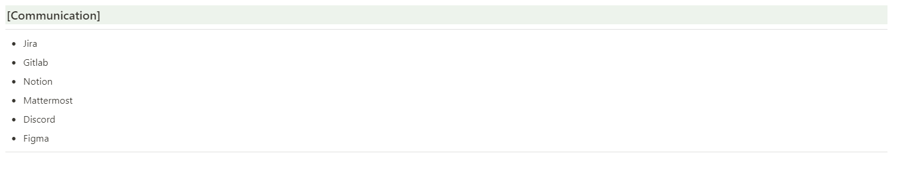
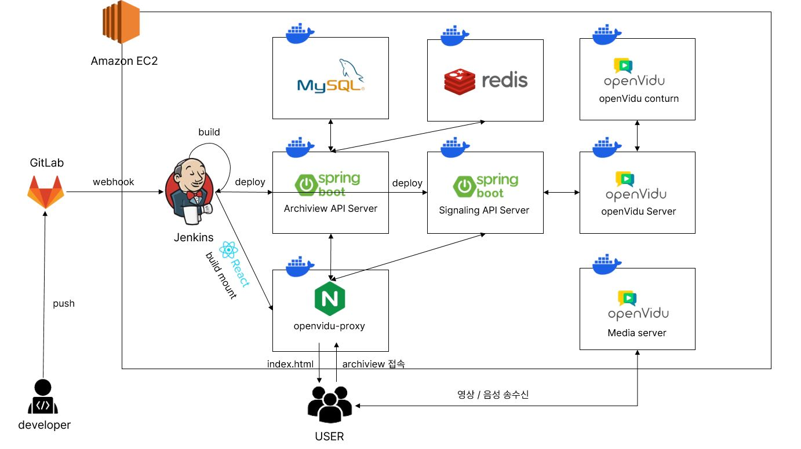

# 

본인의 면접 질문을 저장 및 관리가 가능하며, 이를 다른 사람들과 공유할 수 있는 서비스

```
💡 "혼자서는 빨리 갈 수 있지만, 함께라면 더 멀리 갈 수 있다."
```

<br>

**프로젝트에 대한 자세한 정보는 [🔗여기](https://www.notion.so/ArchiVIEW-f80411bf395f423a83470e3752959183)**

<br>

## 👦 팀원

#### Back

| 오철수                                                                        | 박찬홍                                                                                                                         | 정인상                                |
| ----------------------------------------------------------------------------- | ------------------------------------------------------------------------------------------------------------------------------ | ------------------------------------- |
| - Infra(MSA)<br> - WebRTC서버<br> - P2P서버<br> - 시그널링서버<br> - 파일서버 | - Archiview Server REST API 기능 구현<br> - DB ERD 설계<br>- 프론트엔드 API 연동 및 오류 수정<br> - 프론트엔드/백엔드 CI/CD 구축 | - Archiview Server REST API 기능 구현<br> - DB ERD 설계<br> - Spring Security, JWT를 활용한 인증/인가 프로세스 구현 |

#### Front

| 조영진                                | 김태완                                  | 박영준                       |
| ------------------------------------- | --------------------------------------- | ---------------------------- |
| - UI/UX<br>- API연동<br>- WebRTC 적용 | - 검색창 제작<br> - UI/UX<br> - API연동 | - 와이프레임 제작<br>- UI/UX |

<br>

## 🚩 시작하기

[🔗설명서로 이동](exec/README.md)

<br>

## 📅 개발일정



<br>

## 💰 서비스 가치

- [🔗설문 결과](https://leeward-letter-425.notion.site/256e4cf5a94e4b3cab78c7bac1204b3d), 사이트를 이용한 면접 관리 사이트는 **블루오션**
  - 면접 관리를 하는 인원은 절반도 되지 않으며, 한다 하더라도 대부분 개인 저장을 함
- 본인만의 면접 질문을 저장하고, 태그별로 관리 가능
- 공유를 희망하는 유저에 한하여 타인의 면접 영상을 열람 가능

<br>

## 🔧 서비스 기능


| 기능          | NON-LOGIN | LOGIN-USER | MEMBER | ADMIN |
| ------------- | --------- | ---------- | ------ | ----- |
| 취업 캘린더   | O         | O          | O      | O     |
| 질문 상세검색 | O         | O          | O      | O     |
| 질문 등록     | X         | O          | O      | O     |
| 내 질문 관리  | X         | O          | O      | O     |
| 마이페이지    | X         | O          | O      | O     |
| 질문 상세조회 | X         | X          | O      | O     |
| 회원 관리     | X         | X          | X      | O     |

<br>

## 🧰 기술 스택




<br>

## 📦 프로젝트 구조

#### 아키텍쳐



#### 프론트엔드 파일구조

```
FRONT-END
├─api
├─assets
│  ├─css
│  ├─font
│  └─img
├─components
│  ├─ADM_P_01
│  ├─HOM_M_01
│  ├─LOG_M_01
│  ├─MYI_P_01
│  ├─MYI_P_02
│  ├─MYP_P_01
│  ├─MYP_P_02
│  ├─SCH_P_01
│  └─utils
├─hoc
├─pages
├─store
│  └─slice
└─utils
```

#### 백엔드 파일구조

```
BACK-END
├─.idea
├─Archiview
│  ├─gradle
│  └─src
│      └─main
│         ├─java
│         │  └─com
│         │      └─ssafy
│         │          └─archiview
│         │              ├─config
│         │              ├─controller
│         │              ├─dto
│         │              ├─entity
│         │              ├─filter
│         │              ├─jwt
│         │              ├─repository
│         │              ├─response
│         │              ├─service
│         │              └─validation
│         └─resources
│             └─ssl
│
└─SignalingServer
    ├─gradle
    │  └─wrapper
    └─src
        └─main
           ├─java
           │  └─com
           │      └─ssafy
           │          └─archiview
           │              └─signalingserver
           │                  ├─config
           │                  └─controller
           └─resources
               └─ssl

```
